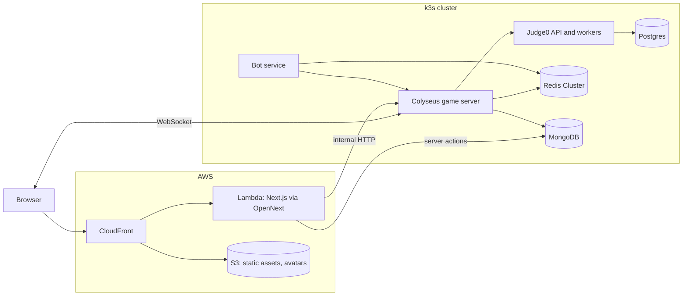

# LeetBattle

Real-time 1v1 coding battles. Two players are matched by rating, receive the same problem, and race to pass every test case. A solution that passes the tests but misses the problem's target time complexity is rejected.

The codebase uses the project's earlier name, CodeClashers, for the Kubernetes namespace, container images and database.

## Features

- Ranked matchmaking on an Elo rating, with a search range that widens the longer a player waits
- Live matches over WebSockets: shared timer, opponent progress, and test results as they come back
- Code execution in Python, JavaScript, Java and C++ on a self-hosted Judge0
- A time-complexity check on every submission that passes its tests
- Bot opponents that fill in when the queue is empty
- Private rooms with share codes, and a guest mode that needs no account
- Leaderboard, match history, and an admin panel for problems, bots and users

## Architecture

The frontend and the backend are deployed separately. The Next.js app runs serverless on AWS. Everything else runs on a self-managed k3s cluster on Oracle Cloud ARM64.


```mermaid
flowchart LR
    Browser

    subgraph AWS
        CF[CloudFront]
        Lambda[Lambda: Next.js via OpenNext]
        S3[(S3: static assets, avatars)]
    end

    subgraph k3s[k3s cluster]
        Colyseus[Colyseus game server]
        Bots[Bot service]
        Judge0[Judge0 API and workers]
        Redis[(Redis Cluster)]
        Mongo[(MongoDB)]
        Postgres[(Postgres)]
    end

    Browser --> CF
    CF --> Lambda
    CF --> S3
    Browser <-->|WebSocket| Colyseus
    Lambda -->|server actions| Mongo
    Lambda -->|internal HTTP| Colyseus
    Colyseus --> Redis
    Colyseus --> Mongo
    Colyseus --> Judge0
    Judge0 --> Postgres
    Bots --> Redis
    Bots --> Colyseus
```

| Component | Stack | Location |
|-----------|-------|----------|
| Frontend | Next.js 15 (App Router, server actions), React 19, Tailwind, shadcn/ui, Monaco | `client/` |
| Frontend infrastructure | AWS CDK: Lambda, CloudFront, S3, Route 53, CloudWatch alarms | `client/infra/` |
| Game server | Colyseus 0.15 on Node.js and TypeScript | `backend/colyseus/` |
| Bot service | Node.js | `backend/bots/` |
| Code execution | Judge0 (vendored) with custom ARM64 images | `backend/judge0/` |
| Data | MongoDB for users, matches and submissions; Redis for the queue, match state and rate limits; Postgres for Judge0 | `backend/k8s/` |
| Cluster manifests | Kustomize base with `dev` and `prod` overlays, Argo CD | `backend/k8s/` |
| CI/CD | GitHub Actions | `.github/workflows/` |

## How a match works

1. A player joins the queue. Their rating goes into a Redis sorted set.
2. A queue room sweeps the set every few seconds and pairs the two closest ratings inside the allowed range. The range starts at ±50 and widens in steps to ±250 as the wait grows.
3. If nobody is found, a bot is offered after a delay. A Lua script claims the waiting player atomically, so two bots can't take the same one.
4. The problem's difficulty is sampled around the pair's average rating.
5. Both players join a Colyseus match room that holds the timer, submissions and results.
6. The first player to pass every test case and the complexity check wins. Ratings update with Elo (K = 32), scaled by the problem's difficulty.

## Code execution

Judge0 has no upstream ARM64 image, so the API and worker images are built from source in this repo. The workers install toolchains for the four supported languages.

For each submission the game server generates one program that runs every test case and prints a line per case, then sends it to Judge0 as a single run. Linked-list and tree arguments are serialized by per-language helpers that are injected only when a problem's signature needs them. Calls to Judge0 go through a rate-limited queue behind a circuit breaker, and an identical resubmission is answered from a Redis cache.

When every test passes, the code goes to an OpenAI model with the problem's target complexity. A failing verdict fails the submission.

New problems go through the admin panel. A model rewrites the statement and derives a function signature, then generates test cases and reference solutions in all four languages. Every reference solution has to pass on Judge0 before the problem can appear in a match.

## Deployment

**Backend.** A push to `main` that touches `backend/` builds the changed images on a self-hosted ARM64 runner and pushes them to GHCR tagged with the commit SHA. Argo CD Image Updater writes the new tag into the `prod` overlay in this repo, and Argo CD syncs the cluster from Git with pruning and self-heal on. The `prod` overlay adds a six-node Redis Cluster and a MongoDB StatefulSet to the base. Prometheus and Grafana run in the cluster.

**Frontend.** A push that touches `client/` builds an OpenNext bundle, and a second workflow deploys it with CDK. CI authenticates to AWS through OIDC, and secrets are read from AWS Secrets Manager at deploy time.

More detail: [`docs/backend/deployment.md`](docs/backend/deployment.md), [`docs/backend/argocd.md`](docs/backend/argocd.md), [`client/infra/README.md`](client/infra/README.md).

## Running locally

Local development uses the same manifests as production, through the `dev` overlay. You need Docker, `kubectl` and Node.js 18 or newer.

```bash
./scripts/dev-setup.sh
```

The script installs k3s if it is missing, creates `.env.dev` from the template, builds the images, applies the `dev` overlay and runs health checks. Problem generation and the complexity check need an `OPENAI_API_KEY` in `.env.dev`.

Then start the frontend:

```bash
cd client
cp .env.local.example .env.local
npm install
npm run dev
```

The app is at http://localhost:3000. See [`docs/backend/local-development.md`](docs/backend/local-development.md) for ports, logs and troubleshooting.

## Documentation

- [`docs/backend/overview.md`](docs/backend/overview.md): index of the backend docs
- [`docs/backend/matchmaking-flow.md`](docs/backend/matchmaking-flow.md): queue pairing and the Redis key map
- [`docs/backend/bot-lifecycle.md`](docs/backend/bot-lifecycle.md): bot service, leader election, deployment rules
- [`docs/backend/judge0-runbook.md`](docs/backend/judge0-runbook.md): submission flow and failure modes
- [`docs/backend/circuit-breaker-judge0.md`](docs/backend/circuit-breaker-judge0.md): backpressure in front of Judge0
- [`docs/frontend/overview.md`](docs/frontend/overview.md): index of the frontend docs

## Limitations

- Automated tests are thin. There is one unit test file, for the bot queue cleanup, and CI does not gate on tests.
- `backend/colyseus/src/index.ts` still defines every HTTP route. A split into route modules was started and not finished.
- Judge0 workers run as privileged containers, because `isolate` needs cgroup access.

## License

MIT. See [LICENSE](LICENSE). The Judge0 source vendored under `backend/judge0/` is licensed GPL-3.0 by its authors.
