# LeetBattle 🏆


**LeetBattle** is a real-time multiplayer coding arena where developers compete head-to-head in timed challenges. Built with Next.js, Colyseus, and Judge0, it combines live collaboration, instant code execution, and competitive matchmaking — all in one seamless platform.

> 🎯 **1v1 coding battles** • ⚡ **Real-time execution** • 🏅 **ELO-based matchmaking** • 🌐 **89+ languages**

---

## 🖼️ Demo

> 📸 **Screenshots and demo video coming soon!**

**Key Features:**
- ⚡ Real-time competitive matches with live opponent updates
- 🎮 Monaco Editor (VS Code engine) with syntax highlighting
- 🏆 Global leaderboard with ELO rating system
- 🔥 Instant code execution and test results
- 💾 Complete match history and statistics
- 🎨 Clean, modern UI with dark mode

---

## ⚙️ Tech Stack

| Layer | Technologies |
|-------|---------------|
| **Frontend** | Next.js 15, TypeScript, Tailwind CSS, shadcn/ui, Monaco Editor, Framer Motion |
| **Realtime** | Colyseus, WebSockets, Redis (Pub/Sub) |
| **Backend** | Node.js, Judge0 (Code Execution), MongoDB, Redis |
| **Storage** | MinIO (S3-compatible for avatars) |
| **Infrastructure** | Docker, Docker Compose |

---

## 🧩 Architecture Overview


**Flow:**
1. **User queues** → Redis sorted set (by ELO)
2. **Background worker** pairs players
3. **Colyseus MatchRoom** manages real-time state
4. **Judge0** executes code in isolated containers
5. **Results stream** back via WebSocket
6. **MongoDB** persists match history & updates ratings

---

## 🚀 Getting Started

### Prerequisites

- **Node.js** 18+
- **Docker** and **Docker Compose**
- **npm** or **pnpm**

### ⚡ Quick Start

```bash
# 1️⃣ Clone the repository
git clone https://github.com/rishabhvenu/LeetBattle.git
cd LeetBattle

# 2️⃣ Start backend services (MongoDB, Redis, Judge0, Colyseus, MinIO)
cd backend
docker-compose up -d

# 3️⃣ Verify services are running
docker-compose ps

# 4️⃣ Install and start frontend
cd ../client
npm install
npm run dev
```

**🎉 Open http://localhost:3000** — Your coding arena is ready!

<details>
<summary>📋 <b>Verify Backend Services</b></summary>

Check all services are healthy:

```bash
cd backend
docker-compose ps
```

Expected output:
```
NAME                    STATUS              PORTS
codeclashers-mongodb    Up                  27017
codeclashers-redis      Up                  6379
codeclashers-minio      Up (healthy)        9000-9001
codeclashers-judge0     Up                  2358
codeclashers-colyseus   Up                  2567
```

Access points:
- 🎮 **Colyseus**: ws://localhost:2567
- 🗄️ **MongoDB**: mongodb://localhost:27017
- 💾 **Redis**: localhost:6379
- 📦 **MinIO Console**: http://localhost:9001 (minioadmin/minioadmin123)
- ⚡ **Judge0 API**: http://localhost:2358

</details>

<details>
<summary>⚙️ <b>Environment Variables</b></summary>

### Backend (`backend/.env`)
```env
# MinIO (S3-compatible avatar storage)
MINIO_ROOT_USER=minioadmin
MINIO_ROOT_PASSWORD=minioadmin123

# Redis (matchmaking queue + caching)
REDIS_PASSWORD=redis_dev_password_123

# Judge0 Database
JUDGE0_POSTGRES_DB=judge0
JUDGE0_POSTGRES_USER=judge0
JUDGE0_POSTGRES_PASSWORD=judge0_secure_pass_456

# Environment
NODE_ENV=development
```

### Client (`client/.env.local`)
```env
# MongoDB (user data + sessions)
MONGODB_URI=mongodb://localhost:27017/codeclashers

# Next.js Authentication
NEXTAUTH_URL=http://localhost:3000
NEXTAUTH_SECRET=dev-secret-key-change-in-production-min-32-chars-required

# Colyseus (real-time game server)
NEXT_PUBLIC_COLYSEUS_HTTP_URL=http://localhost:2567
NEXT_PUBLIC_COLYSEUS_WS_URL=ws://localhost:2567

# MinIO (avatar storage)
S3_ENDPOINT=http://localhost:9000
AWS_ACCESS_KEY_ID=minioadmin
AWS_SECRET_ACCESS_KEY=minioadmin123
S3_BUCKET_NAME=codeclashers-avatars
AWS_REGION=us-east-1

# Redis (matchmaking + events)
REDIS_HOST=127.0.0.1
REDIS_PORT=6379
REDIS_PASSWORD=redis_dev_password_123
```

**⚠️ Security Note:** These are development credentials. Generate strong passwords for production!

</details>

---

## 🎮 How It Works

```mermaid
sequenceDiagram
    participant User as 👤 Player
    participant Client as Next.js Client
    participant Queue as QueueRoom
    participant Redis as Redis Queue
    participant Worker as Matchmaker
    participant Match as MatchRoom
    participant Judge0 as Judge0
    participant DB as MongoDB

    User->>Client: Click "Find Match"
    Client->>Queue: Join queue with ELO
    Queue->>Redis: Add to sorted set
    
    Worker->>Redis: Poll for matches
    Worker->>Worker: Pair by ELO (±200)
    Worker->>Match: Create MatchRoom
    Match->>Client: WebSocket connect
    Match->>Client: Send problem
    
    User->>Client: Write code
    Client->>Match: Submit solution
    Match->>Judge0: Execute code
    Judge0->>Match: Return results
    Match->>Client: Stream results
    
    Match->>Match: First to pass wins
    Match->>DB: Save match results
    Match->>DB: Update ELO ratings
    Match->>Redis: Publish match_end
    Redis->>Worker: Persist to MongoDB
```



### Key Features

**1. Smart Matchmaking**
- ELO-based pairing (within ±200 rating)
- Fair queue using Redis sorted sets
- Automatic timeout handling

**2. Real-Time Sync**
- Live opponent code execution status
- Instant test case results
- Countdown timer synchronization

**3. Code Execution**
- 89+ programming languages supported
- Isolated Docker containers per submission
- Test case streaming (pass/fail indicators)

**4. Persistence**
- Connection pooling (17x faster than per-request)
- Redis pub/sub for match events
- Background workers for async operations

---

## 📁 Project Structure

<details>
<summary>Click to expand full structure</summary>

```
LeetBattle/
├── backend/                      # Backend infrastructure
│   ├── colyseus/                # Real-time game server
│   │   ├── src/
│   │   │   ├── index.ts         # Server entry point
│   │   │   ├── rooms/           # Game room logic
│   │   │   │   ├── MatchRoom.ts # 1v1 competitive match
│   │   │   │   └── QueueRoom.ts # Matchmaking queue
│   │   │   ├── lib/
│   │   │   │   ├── codeRunner.ts    # Judge0 integration
│   │   │   │   ├── testExecutor.ts  # Test case runner
│   │   │   │   └── queue.ts         # Matchmaking logic
│   │   │   └── workers/
│   │   │       └── matchmaker.ts    # Background pairing
│   │   └── package.json
│   ├── docker-compose.yml       # All services
│   └── .env                     # Dev credentials
│
├── client/                       # Next.js frontend
│   ├── src/
│   │   ├── app/                 # Next.js 15 App Router
│   │   │   ├── match/           # Live match UI
│   │   │   ├── queue/           # Matchmaking queue
│   │   │   ├── leaderboard/     # Global rankings
│   │   │   └── play/            # Main lobby
│   │   ├── components/
│   │   │   ├── ui/              # shadcn/ui components
│   │   │   └── ...              # Match animations, timers
│   │   ├── lib/
│   │   │   ├── actions.ts       # Server actions
│   │   │   ├── mongodb.ts       # DB singleton
│   │   │   └── redis.ts         # Cache client
│   │   └── pages/
│   │       └── match/
│   │           └── MatchClient.tsx  # Real-time match
│   └── package.json
│
└── problems.json                 # Problem library
```

</details>

---

## 🧪 Development

### Useful Commands

```bash
# Backend Services
cd backend
docker-compose logs -f           # View all logs
docker-compose restart [service] # Restart specific service
docker-compose down              # Stop all services

# Frontend
cd client
npm run dev                      # Development server (Turbopack)
npm run build                    # Production build
npm run lint                     # ESLint

# Colyseus Standalone
cd backend/colyseus
npm run dev                      # Watch mode with hot reload
npm run build                    # Compile TypeScript
```

### Key Ports

| Service | Port | Description |
|---------|------|-------------|
| Next.js | 3000 | Frontend app |
| Colyseus | 2567 | Game server (WebSocket) |
| MongoDB | 27017 | Database |
| Redis | 6379 | Queue & cache |
| MinIO | 9000 | S3 API |
| MinIO Console | 9001 | Web UI |
| Judge0 | 2358 | Code execution |

---

## 🐛 Troubleshooting

<details>
<summary><b>MongoDB Connection Errors</b></summary>

```bash
# Check if MongoDB is running
docker-compose ps mongodb

# View logs
docker-compose logs mongodb

# Restart
docker-compose restart mongodb
```

</details>

<details>
<summary><b>Redis Authentication Failed</b></summary>

Ensure passwords match in both `backend/.env` and `client/.env.local`:
```env
REDIS_PASSWORD=redis_dev_password_123
```

Restart Next.js after changing env vars:
```bash
cd client
# Stop with Ctrl+C, then
npm run dev
```

</details>

<details>
<summary><b>Judge0 Not Executing Code</b></summary>

```bash
# Check Judge0 services
docker-compose logs judge0-server
docker-compose logs judge0-worker

# Restart both
docker-compose restart judge0-server judge0-worker judge0-db
```

</details>

<details>
<summary><b>MinIO Bucket Not Found</b></summary>

```bash
# Re-run bucket initialization
docker-compose restart minio-init
docker-compose logs minio-init
```

</details>

---

## 🛣️ Roadmap

- [ ] 🤖 **AI opponent mode** (practice without waiting for players)
- [ ] 👥 **Team-based matches** (2v2, 3v3 competitive teams)
- [ ] 🏆 **Tournament brackets** (scheduled events with prizes)
- [ ] 👁️ **Spectator mode** (watch live matches)
- [ ] 🎤 **Voice chat integration** (optional during matches)
- [ ] 📊 **Advanced analytics** (code complexity, time metrics)
- [ ] 🎯 **Custom problems** (user-submitted challenges)
- [ ] 🌍 **Regional servers** (reduce latency worldwide)
- [ ] 📱 **Mobile app** (React Native client)

---

## 📦 Deployment

### Docker Compose (Recommended for VPS)

```bash
# Update environment variables for production
cd backend
nano .env  # Set strong passwords

# Build and start
docker-compose up -d --build

# Check all services
docker-compose ps
```

### Cloud Deployment Options

| Service | Recommended Platform |
|---------|---------------------|
| **Frontend** | Vercel, Netlify, Railway |
| **Colyseus** | DigitalOcean Droplet, AWS EC2, Railway |
| **MongoDB** | MongoDB Atlas (managed) |
| **Redis** | Redis Cloud, AWS ElastiCache |
| **MinIO** | AWS S3, DigitalOcean Spaces |

---

## 🔒 Security & Production Notes

### ⚠️ Before Production Deployment

**1. Rotate All Credentials**
- `.env` files currently contain development credentials
- Generate strong passwords: `openssl rand -base64 32`
- Update: `MINIO_ROOT_PASSWORD`, `REDIS_PASSWORD`, `JUDGE0_POSTGRES_PASSWORD`, `NEXTAUTH_SECRET`

**2. Update CORS Configuration**
- Edit `backend/minio-init/init.sh`
- Replace `localhost` origins with your production domain

**3. Queue Worker Limitation**
- Current implementation uses `setInterval` in server action
- ⚠️ **Won't work on serverless platforms** (Vercel, Netlify)
- ✅ **Works on dedicated servers** (DigitalOcean, AWS EC2)
- For serverless: Move to separate worker service or use Bull/BullMQ

**4. Production Checklist:**
- [ ] Credentials rotated (not using dev defaults)
- [ ] SSL/TLS certificates installed
- [ ] `NODE_ENV=production` set
- [ ] CORS configured for production domains
- [ ] Rate limiting enabled
- [ ] Error tracking configured (Sentry)
- [ ] Monitoring set up (Datadog, New Relic)
- [ ] Database backups automated

---

## 👥 Maintainers

**Rishabh Ryan Venu** – [@rishabhvenu](https://github.com/rishabhvenu)

Contributions are welcome! See our [Contributing Guide](#-contributing) below.

---

## 🤝 Contributing

We welcome contributions! Here's how to get started:

1. **Fork** the repository
2. **Create** a feature branch (`git checkout -b feature/amazing-feature`)
3. **Commit** your changes (`git commit -m 'Add amazing feature'`)
4. **Push** to the branch (`git push origin feature/amazing-feature`)
5. **Open** a Pull Request

### Development Guidelines

- Follow existing code style (ESLint + Prettier)
- Write clear commit messages
- Add tests for new features
- Update documentation as needed
- Test locally with `docker-compose up`

---

## 📄 License

This project is licensed under the **MIT License** - see the [LICENSE](LICENSE) file for details.

---

## 🙏 Acknowledgments

Built with amazing open-source technologies:

- [**Judge0**](https://judge0.com/) - Robust code execution engine
- [**Colyseus**](https://colyseus.io/) - Multiplayer game server framework
- [**Next.js**](https://nextjs.org/) - The React framework for production
- [**shadcn/ui**](https://ui.shadcn.com/) - Beautiful, accessible UI components
- [**Monaco Editor**](https://microsoft.github.io/monaco-editor/) - VS Code's powerful editor
- [**MongoDB**](https://www.mongodb.com/) - Flexible document database
- [**Redis**](https://redis.io/) - In-memory data structure store

---

<div align="center">

**⭐ Star this repo if you found it helpful!**

Built with ❤️ by competitive programmers, for competitive programmers.

[Report Bug](https://github.com/rishabhvenu/LeetBattle/issues) · [Request Feature](https://github.com/rishabhvenu/LeetBattle/issues) · [Documentation](https://github.com/rishabhvenu/LeetBattle/wiki)

</div>
