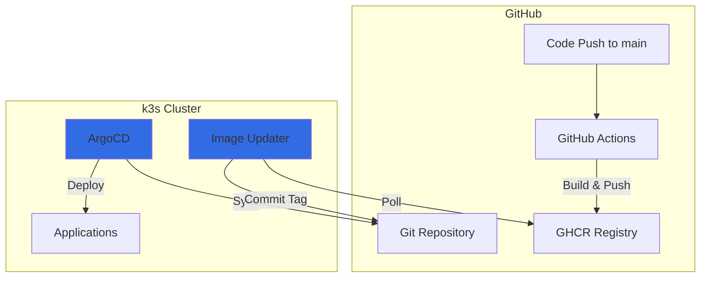

# ArgoCD GitOps Deployment Guide

Complete guide for ArgoCD and ArgoCD Image Updater setup on the CodeClashers k3s cluster.

---

## Table of Contents

1. [Overview](#overview)
2. [Architecture](#architecture)
3. [Prerequisites](#prerequisites)
4. [Installation](#installation)
5. [Configuration](#configuration)
6. [Image Auto-Update Setup](#image-auto-update-setup)
7. [Deployment Workflow](#deployment-workflow)
8. [ArgoCD UI Access](#argocd-ui-access)
9. [Monitoring & Operations](#monitoring--operations)
10. [Troubleshooting](#troubleshooting)

---

## Overview

ArgoCD provides GitOps continuous delivery for Kubernetes. The setup includes:

- **ArgoCD**: Syncs Kubernetes manifests from Git to the cluster
- **ArgoCD Image Updater**: Automatically detects new container images and updates manifests
- **GitHub Container Registry**: Source for container images
- **GitHub Repository**: Single source of truth for all manifests

### Key Benefits

- ✅ **Declarative GitOps**: All infrastructure as code in Git
- ✅ **Automated Deployments**: New images trigger automatic updates
- ✅ **Audit Trail**: All changes tracked in Git history
- ✅ **Easy Rollback**: Revert to any previous Git commit
- ✅ **Self-Healing**: ArgoCD automatically corrects configuration drift

---

## Architecture



### How It Works

1. **Developer pushes code** to `main` branch
2. **GitHub Actions builds** Docker images with commit SHA tags and `:latest` tag
3. **Images pushed** to GitHub Container Registry (GHCR)
4. **Image Updater detects** new `:latest` tag
5. **Image Updater commits** new tag to `backend/k8s/overlays/prod/kustomization.yaml`
6. **ArgoCD detects** Git change and syncs to cluster
7. **Rolling update** deploys new version with zero downtime

---

## Prerequisites

- ✅ k3s cluster running on Oracle Cloud VM
- ✅ GitHub repository with Kubernetes manifests
- ✅ GitHub Personal Access Tokens (2 required):
  - **PAT 1**: `read:packages` scope (for Image Updater to read GHCR)
  - **PAT 2**: `repo` scope (for Image Updater to commit to Git)

---

## Installation

### Step 1: Install ArgoCD

```bash
# SSH into Oracle VM
ssh ubuntu@<VM_IP>

# Navigate to repo
cd /opt/codeclashers

# Apply ArgoCD manifests
sudo k3s kubectl apply -k backend/k8s/argocd/

# Wait for pods to be ready (2-3 minutes)
sudo k3s kubectl wait --for=condition=ready pod -l app.kubernetes.io/name=argocd-server -n argocd --timeout=300s
```

### Step 2: Get Initial Admin Password

```bash
# Get ArgoCD admin password
sudo k3s kubectl -n argocd get secret argocd-initial-admin-secret -o jsonpath="{.data.password}" | base64 -d
echo
```

**Save this password** - you'll need it to access the ArgoCD UI.

### Step 3: Access ArgoCD UI

Open browser to: `http://<VM_IP>:30080`

- **Username**: `admin`
- **Password**: (from step 2)

---

## Configuration

### Create Required Secrets

#### 1. GHCR Registry Secret (for Image Updater)

This allows Image Updater to poll GHCR for new images.

```bash
# Generate PAT at: https://github.com/settings/tokens
# Required scope: read:packages

sudo k3s kubectl create secret generic ghcr-image-updater-secret \
  --from-literal=creds=<GITHUB_USERNAME>:<PAT> \
  -n argocd
```

#### 2. Git Credentials Secret (for Image Updater)

This allows Image Updater to commit tag updates to Git.

```bash
# Generate PAT at: https://github.com/settings/tokens
# Required scope: repo (Full control)

sudo k3s kubectl create secret generic git-creds \
  --from-literal=username=<GITHUB_USERNAME> \
  --from-literal=password=<PAT_WITH_REPO_SCOPE> \
  -n argocd
```

#### 3. ArgoCD Token Secret (for Image Updater)

This allows Image Updater to communicate with ArgoCD API.

**Option A: Using Admin Token (Quick Setup)**

```bash
# Get admin password
ADMIN_PASSWORD=$(sudo k3s kubectl -n argocd get secret argocd-initial-admin-secret -o jsonpath="{.data.password}" | base64 -d)

# Login to ArgoCD (install CLI if needed)
# Download from: https://github.com/argoproj/argo-cd/releases
argocd login <VM_IP>:30080 --username admin --password "$ADMIN_PASSWORD" --insecure

# Generate token (expires in 1 year)
TOKEN=$(argocd account generate-token --account admin)

# Create secret
sudo k3s kubectl create secret generic argocd-image-updater-secret \
  --from-literal=argocd.token="$TOKEN" \
  -n argocd
```

**Option B: Create Dedicated Account (Recommended for Production)**

```bash
# Create image-updater account in ArgoCD
# Add to argocd-cm ConfigMap:
sudo k3s kubectl patch configmap argocd-cm -n argocd --type merge -p '{"data":{"accounts.image-updater":"apiKey"}}'

# Grant permissions in argocd-rbac-cm:
sudo k3s kubectl patch configmap argocd-rbac-cm -n argocd --type merge -p '{"data":{"policy.csv":"p, role:image-updater, applications, get, */*, allow\np, role:image-updater, applications, update, */*, allow\ng, image-updater, role:image-updater"}}'

# Generate token for image-updater account
argocd account generate-token --account image-updater --id image-updater

# Create secret with token
sudo k3s kubectl create secret generic argocd-image-updater-secret \
  --from-literal=argocd.token="<TOKEN>" \
  -n argocd
```

---

## Image Auto-Update Setup

### How Image Updater Works

1. **Polling**: Checks GHCR every 2 minutes for new image tags
2. **Filtering**: Only considers tags matching `regexp:^[a-f0-9]{7}$` (7-char commit SHAs)
3. **Strategy**: Tracks `:latest` tag by digest changes
4. **Update**: When new `:latest` detected, commits SHA tag to kustomization.yaml
5. **Trigger**: ArgoCD detects Git change and syncs to cluster

### Configuration

Image Updater is configured via annotations on the Application manifest:

```yaml
# backend/k8s/argocd/applications/codeclashers-prod.yaml
metadata:
  annotations:
    # List of images to track
    argocd-image-updater.argoproj.io/image-list: |
      colyseus=ghcr.io/rishabhvenu/codeclashers-colyseus,
      bots=ghcr.io/rishabhvenu/codeclashers-bots,
      judge0-api=ghcr.io/rishabhvenu/codeclashers-judge0-api-arm64,
      judge0-worker=ghcr.io/rishabhvenu/codeclashers-judge0-worker-arm64
    
    # Update strategy: track :latest by digest
    argocd-image-updater.argoproj.io/colyseus.update-strategy: latest
    
    # Only allow commit SHA tags
    argocd-image-updater.argoproj.io/colyseus.allow-tags: "regexp:^[a-f0-9]{7}$"
    
    # Write back to Git
    argocd-image-updater.argoproj.io/write-back-method: git:secret:argocd/git-creds
    argocd-image-updater.argoproj.io/write-back-target: "kustomization:backend/k8s/overlays/prod"
```

### Verify Image Updater

```bash
# Check Image Updater pod
sudo k3s kubectl get pods -n argocd -l app.kubernetes.io/name=argocd-image-updater

# View Image Updater logs
sudo k3s kubectl logs -n argocd -l app.kubernetes.io/name=argocd-image-updater -f

# Check for successful updates (should see):
# time="..." level=info msg="Setting new image to ghcr.io/rishabhvenu/codeclashers-colyseus:abc1234"
```

---

## Deployment Workflow

### Deploy the Application

```bash
# Apply the Application manifest
sudo k3s kubectl apply -f backend/k8s/argocd/applications/codeclashers-prod.yaml

# Watch sync progress
sudo k3s kubectl get application -n argocd -w

# Or use ArgoCD CLI
argocd app sync codeclashers-prod
argocd app wait codeclashers-prod
```

### Normal Development Flow

1. **Push code** to `main` branch
2. **GitHub Actions** builds and pushes images (5-10 minutes)
3. **Image Updater** detects new image (within 2 minutes)
4. **ArgoCD syncs** to cluster (within 3 minutes)

**Total time**: ~10-15 minutes from code push to production

### Manual Sync

If you need to force a sync immediately:

```bash
# Via CLI
argocd app sync codeclashers-prod

# Or via UI: Click "Sync" button in ArgoCD dashboard
```

---

## ArgoCD UI Access

### Local Access

- **URL**: `http://<VM_IP>:30080`
- **Secure URL**: `http://<VM_IP>:30443` (if you configure TLS)

### UI Features

- **Applications**: View all deployed apps
- **Sync Status**: See if cluster matches Git
- **Health Status**: Check pod health
- **Diff View**: Compare Git vs cluster state
- **Logs**: View pod logs
- **Rollback**: Revert to previous Git revision
- **Manual Sync**: Force immediate deployment

### Change Admin Password

```bash
# Via CLI
argocd account update-password
```

Or via UI: **User Info → Update Password**

---

## Monitoring & Operations

### Check Application Status

```bash
# Get application details
argocd app get codeclashers-prod

# List all applications
argocd app list

# View sync history
argocd app history codeclashers-prod
```

### View Sync Status

```bash
# Check if sync is needed
sudo k3s kubectl get application codeclashers-prod -n argocd -o jsonpath='{.status.sync.status}'

# Should return: "Synced"
```

### Monitor Image Updates

```bash
# Check Image Updater logs
sudo k3s kubectl logs -n argocd deployment/argocd-image-updater -f --tail=50

# Look for messages like:
# level=info msg="Committing 4 image changes to repository"
# level=info msg="Successfully updated image 'colyseus' to tag 'abc1234'"
```

### View Last Update Time

```bash
# Check last update annotation
sudo k3s kubectl get application codeclashers-prod -n argocd \
  -o jsonpath='{.metadata.annotations.argocd-image-updater\.argoproj\.io/last-update-time}'
```

---

## Troubleshooting

### Application Not Syncing

**Symptoms**: ArgoCD shows "OutOfSync" status

**Solutions**:

```bash
# 1. Check for sync errors
argocd app get codeclashers-prod

# 2. View detailed sync status
sudo k3s kubectl describe application codeclashers-prod -n argocd

# 3. Force sync
argocd app sync codeclashers-prod --force

# 4. Check ArgoCD logs
sudo k3s kubectl logs -n argocd deployment/argocd-server -f
```

### Image Updater Not Updating

**Symptoms**: New images pushed but not deployed

**Check 1: Verify secrets exist**

```bash
sudo k3s kubectl get secret ghcr-image-updater-secret -n argocd
sudo k3s kubectl get secret git-creds -n argocd
sudo k3s kubectl get secret argocd-image-updater-secret -n argocd
```

**Check 2: View Image Updater logs**

```bash
sudo k3s kubectl logs -n argocd deployment/argocd-image-updater --tail=100

# Look for errors like:
# level=error msg="Could not get tags from registry"
# level=error msg="Could not commit changes: authentication required"
```

**Check 3: Verify registry access**

```bash
# Test GHCR access
docker login ghcr.io -u <USERNAME> -p <PAT>
docker pull ghcr.io/rishabhvenu/codeclashers-colyseus:latest
```

**Check 4: Verify Git access**

```bash
# Test git push (should not require password)
git clone https://<USERNAME>:<PAT>@github.com/rishabhvenu/codeclashers.git /tmp/test
```

### Health Check Failures

**Symptoms**: Pods show as "Degraded" in ArgoCD

**Solutions**:

```bash
# Check pod logs
sudo k3s kubectl logs -n codeclashers deployment/colyseus --tail=50

# Check pod events
sudo k3s kubectl describe pod -n codeclashers -l app=colyseus

# Verify health probes
sudo k3s kubectl get pods -n codeclashers -o wide
```

### Image Pull Errors

**Symptoms**: Pods stuck in `ImagePullBackOff`

**Solutions**:

```bash
# 1. Verify ghcr-secret exists in codeclashers namespace
sudo k3s kubectl get secret ghcr-secret -n codeclashers

# 2. Verify image exists
docker manifest inspect ghcr.io/rishabhvenu/codeclashers-colyseus:latest

# 3. Check if public or requires auth
# If private, ensure ghcr-secret has valid credentials
```

### ArgoCD UI Not Accessible

**Symptoms**: Cannot access ArgoCD on port 30080

**Solutions**:

```bash
# 1. Check NodePort service
sudo k3s kubectl get svc argocd-server-nodeport -n argocd

# 2. Verify firewall allows port 30080
sudo ufw status | grep 30080

# 3. Check ArgoCD server pod
sudo k3s kubectl get pods -n argocd -l app.kubernetes.io/name=argocd-server

# 4. Port forward as temporary workaround
sudo k3s kubectl port-forward svc/argocd-server -n argocd 8080:80
# Access at: http://localhost:8080
```

### Rollback to Previous Version

**Via Git:**

```bash
# 1. Revert kustomization.yaml to previous commit
cd /opt/codeclashers
git log backend/k8s/overlays/prod/kustomization.yaml
git revert <commit-sha>
git push

# ArgoCD will automatically sync the rollback
```

**Via ArgoCD:**

```bash
# List history
argocd app history codeclashers-prod

# Rollback to specific revision
argocd app rollback codeclashers-prod <revision-id>
```

**Via UI:**

1. Open ArgoCD UI
2. Select `codeclashers-prod` application
3. Click **History and Rollback**
4. Select previous revision
5. Click **Rollback**

---

## Advanced Configuration

### Customize Sync Policy

Edit `backend/k8s/argocd/applications/codeclashers-prod.yaml`:

```yaml
spec:
  syncPolicy:
    automated:
      prune: true        # Delete resources not in Git
      selfHeal: true     # Revert manual changes
      allowEmpty: false  # Prevent deletion of all resources
    syncOptions:
    - CreateNamespace=true
    - PrunePropagationPolicy=foreground
    retry:
      limit: 5
      backoff:
        duration: 5s
        factor: 2
        maxDuration: 3m
```

### Adjust Image Updater Interval

Edit `backend/k8s/argocd/image-updater/install.yaml`:

```yaml
env:
- name: ARGOCD_IMAGE_UPDATER_INTERVAL
  value: "1m"  # Check for updates every 1 minute (default: 2m)
```

### Enable Notifications

Configure ArgoCD notifications to Slack/Discord/Email when deployments complete.

See: https://argo-cd.readthedocs.io/en/stable/operator-manual/notifications/

---

## Best Practices

1. **Never kubectl apply directly** - Always commit to Git and let ArgoCD sync
2. **Use Git for rollbacks** - Revert commits instead of manual kubectl commands
3. **Monitor Image Updater logs** - Watch for authentication failures
4. **Tag semantic versions** - Use `v1.2.3` tags for releases (in addition to commit SHAs)
5. **Review auto-commits** - Check Image Updater's Git commits periodically
6. **Protect main branch** - Require PR reviews for manual manifest changes
7. **Backup secrets** - Store ArgoCD admin password securely

---

## Useful Commands Cheat Sheet

```bash
# ArgoCD
argocd app list                              # List all applications
argocd app get codeclashers-prod            # Get app details
argocd app sync codeclashers-prod           # Trigger sync
argocd app history codeclashers-prod        # View deployment history
argocd app rollback codeclashers-prod 3     # Rollback to revision 3
argocd app diff codeclashers-prod           # Show diff between Git and cluster

# Image Updater
kubectl logs -n argocd deployment/argocd-image-updater -f --tail=50
kubectl get secret -n argocd | grep image-updater

# Applications
kubectl get application -n argocd
kubectl describe application codeclashers-prod -n argocd
kubectl get application codeclashers-prod -n argocd -o yaml

# Deployed Resources
kubectl get all -n codeclashers
kubectl get pods -n codeclashers -o wide
kubectl logs -n codeclashers deployment/colyseus -f
```

---

## References

- [ArgoCD Official Docs](https://argo-cd.readthedocs.io/)
- [ArgoCD Image Updater Docs](https://argocd-image-updater.readthedocs.io/)
- [Kustomize Reference](https://kubectl.docs.kubernetes.io/references/kustomize/)
- [GitOps Principles](https://opengitops.dev/)


